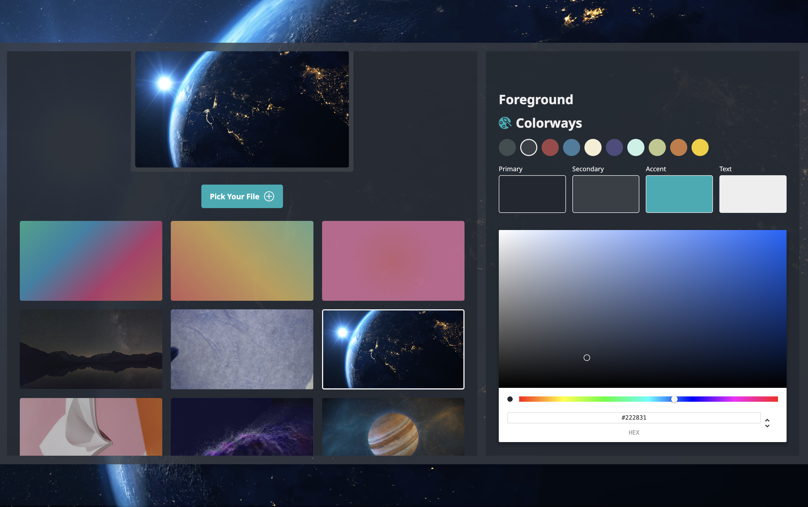

# Theme Playground 🎨

A desktop theme customization application built with Electron, React, and TypeScript. Theme Playground allows users to personalize application colors and backgrounds, choose animated CSS gradients, upload local images or videos, and persist their preferences across application restarts.

**Tech Stack:** Electron, React, TypeScript, Tailwind CSS, Vite, electron-store

## Screenshot



## Features

### Theme Customization

- Customize primary, secondary, accent, and text colors.
- Choose from predefined colorways for quick theme changes.
- Preview theme changes directly within the application.
- Automatically persist custom theme settings between sessions.

### Background Customization

- Choose from predefined image and animated CSS gradient backgrounds.
- Use CSS keyframe animations to create dynamic linear and radial gradient effects.
- Upload local images as custom backgrounds.
- Upload and play local MP4 video backgrounds.
- Preview the currently selected background directly in the application.
- Preserve background selections across application restarts.

### Local Media Persistence

Uploaded background files are copied into the application's Electron `userData` directory instead of relying on the original file location.

This allows custom backgrounds to remain available even if the original image or video is moved or deleted.

### Electron IPC

Theme Playground uses Electron's main and renderer process architecture to handle desktop-specific functionality.

Local file operations follow this flow:

```text
React Renderer
      ↓
Preload / contextBridge
      ↓
Electron IPC
      ↓
Main Process
      ↓
Local Filesystem
      ↓
electron-store
```

The renderer communicates with the main process through a preload bridge, allowing the application to perform local file operations while keeping Electron-specific APIs isolated from the React UI.

## Persistence

Application preferences are stored using `electron-store`.

Persisted settings include:

- Selected background
- Custom background file location
- Primary color
- Secondary color
- Accent color
- Text color
- Selected theme settings

Uploaded media files are stored separately within the application's `userData` directory.

On macOS, application data is typically stored under:

```text
~/Library/Application Support/<app-name>/
```

For example:

```text
<userData>/
├── backgrounds/
│   ├── custom-background.jpg
│   └── custom-background.mp4
└── config.json
```

## Project Structure

```text
src/
├── components/     # React UI components
├── hooks/          # Custom React hooks and application context
├── data/           # Predefined themes and background options
└── assets/         # Application images, videos, and icons

main.ts             # Electron main process and application lifecycle
preload.ts          # Secure bridge between renderer and main process
```

## Installation

### Prerequisites

- Node.js 20 (recommended)
- npm

### Setup

1. Clone the repository:

```bash
git clone https://github.com/LizzzYu/theme-playground.git
cd theme-playground
```

2. Install dependencies:

```bash
npm install
```

3. Start the development environment:

```bash
npm run dev
```

This starts the Vite development server and launches the Electron application.

> **Note:** This project is designed as an Electron desktop application. Some features, including local file handling and background persistence, depend on Electron APIs and are not available when the Vite development URL is opened directly in a browser.

## Build

Create a production build using:

```bash
npm run build
```

The build process runs TypeScript compilation, creates the Vite production build, and packages the desktop application using `electron-builder`.

## Available Commands

- `npm run dev` — Start the application in development mode.
- `npm run build` — Compile TypeScript, build the frontend, and package the Electron application.
- `npm run lint` — Run ESLint.
- `npm run preview` — Preview the Vite frontend build.
- `npm start` — Launch Electron directly.

## Usage

### Choose a Background

Select one of the predefined image or animated gradient backgrounds, or click **Pick Your File** to use a local image or video.

Uploaded media is copied into the application's local data directory so that it remains available across sessions even if the original file is moved or deleted.

### Customize Colors

Choose one of the predefined colorways or customize individual theme colors:

- Primary
- Secondary
- Accent
- Text

Changes are applied immediately and automatically persisted.

### Animated Gradient Backgrounds

Theme Playground includes animated linear and radial gradient backgrounds implemented using CSS keyframes.

```css
.background-animate-1 {
  background: linear-gradient(-45deg, #ee7752, #e73c7e, #23a6d5, #23d5ab);
  background-size: 400% 400%;
  animation: gradientAnimation 15s ease infinite;
}

@keyframes gradientAnimation {
  0% {
    background-position: 0% 50%;
  }

  50% {
    background-position: 100% 50%;
  }

  100% {
    background-position: 0% 50%;
  }
}
```

## Technical Highlights

- Electron main and renderer process communication using IPC.
- Secure renderer API exposure through `preload.ts` and `contextBridge`.
- Local image and video handling using Electron filesystem APIs.
- Persistent application settings using `electron-store`.
- Custom background files stored within Electron's application data directory.
- Animated linear and radial gradient backgrounds implemented with CSS keyframes.
- React and TypeScript component architecture.
- Responsive interface styling with Tailwind CSS.
- Desktop application packaging with `electron-builder`.
